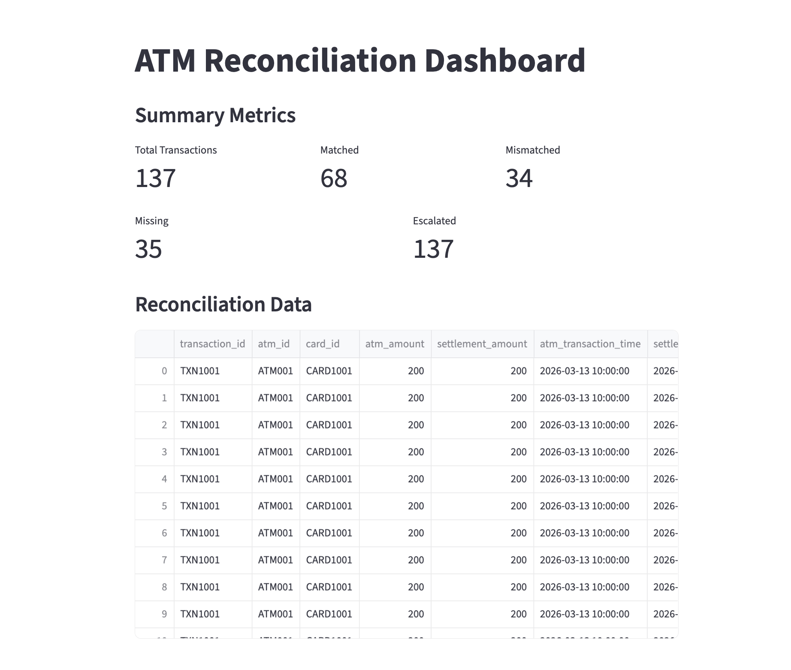
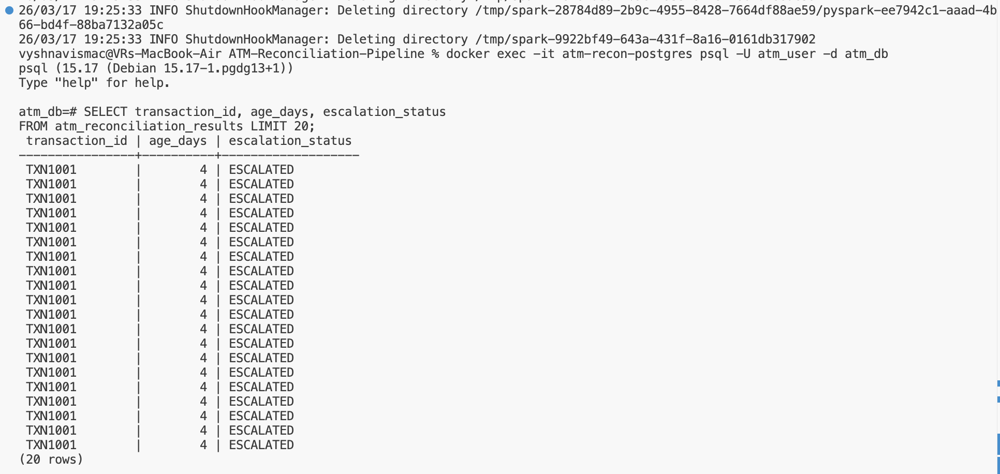
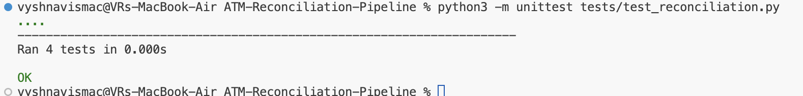

# ATM Transaction Reconciliation Pipeline

## 📌 Overview
This project implements an end-to-end data pipeline to reconcile ATM transactions with settlement records using Apache Kafka and PySpark. It simulates real-time ingestion and batch reconciliation, ensuring data accuracy and identifying discrepancies.

---

## ⚙️ Tech Stack
- Python
- Apache Kafka
- PySpark (Streaming + Batch)
- PostgreSQL
- Docker
- Streamlit (Dashboard)
- Airflow (Scheduling)
- GitHub Actions (CI/CD)

---

## 🏗️ Architecture
- ATM transactions are generated using a Kafka producer
- Kafka streams data into PySpark Structured Streaming
- Data is stored in PostgreSQL (`atm_transactions`)
- Settlement data is ingested as batch (CSV)
- PySpark batch job performs reconciliation
- Results stored in `atm_reconciliation_results`
- Streamlit dashboard visualizes results

---

## 🔍 Reconciliation Logic
- MATCHED: ATM and settlement amounts match
- MISSING_IN_SETTLEMENT: ATM record not found in settlement
- MISSING_IN_ATM: Settlement record not found in ATM logs
- AMOUNT_MISMATCH: Amounts differ

---

## ⏳ Exception Aging & Escalation
- Age calculated using transaction timestamp
- Escalation rules:
  - 0–1 days → NORMAL
  - 2–3 days → WARNING
  - 3+ days → ESCALATED

---

## 📊 Dashboard
- Displays total transactions
- Shows matched, mismatched, and missing counts
- Highlights escalated transactions
- Built using Streamlit

---

## 🔁 CI/CD with Jenkins

A Jenkins pipeline is defined using a Jenkinsfile to automate the workflow.

---

### Pipeline Stages:
- Checkout source code
- Install dependencies
- Run unit tests
- Execute Spark reconciliation job

This ensures continuous integration and validation of the data pipeline.

---

## 🚀 How to Run
1. Start services:
   docker-compose up -d

2. Run reconciliation job:
   docker exec -it atm-recon-spark-master /opt/spark/bin/spark-submit /spark/atm_reconciliation_job.py

3. Launch dashboard:
   streamlit run dashboard/app.py

---

## 📸 Screenshots

### Dashboard

### Reconciliation Output

### Unit Test Results

### Jenkins Pipeline

---

## ✅ Key Outcomes
- Built scalable reconciliation pipeline
- Implemented real-time + batch processing
- Identified discrepancies and escalations
- Visualized insights through dashboard
   docker-compose up -d